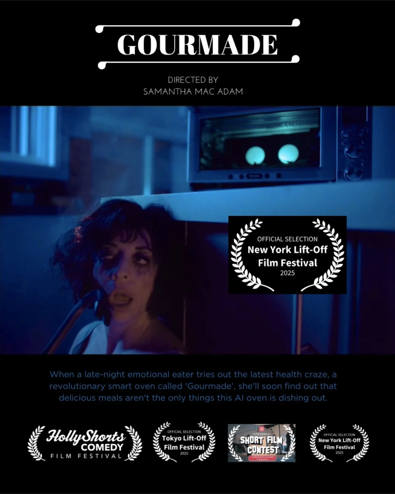
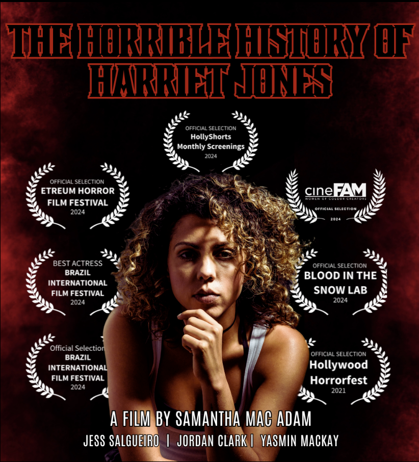

## Frontmatters

#film-tv #commercials #producer #production 

 A selection of work I've produced. In addition to other roles across the development/production value chain, I've worked as a consultant for production companies, grants bodies, financiers and equity investors in Canada, US, and the Arabian Gulf. 

> [!story]- Interested in writing samples? 
> Check out[[Film & TV Script Samples|film and tv script samples]]for scenes from features and TV pilots.  
> For coverage samples and evaluations, reach out at moe[at]moesfrontmatters.com

---

<a href="https://www.youtube.com" class="film-card" target="_blank" rel="noopener">
  
  

    <h3>Prom Night (2017)</h3>
    
<strong>Role:</strong> Producer, Production Manager

    
<strong>Runtime:</strong> 13m 56s

    
<strong>Genre:</strong> Comedy

    
<strong>Dir:</strong> Sam MacAdam

    
<strong>Cast:</strong> Gerry Dee, Trevor Tordjman, Carol Huska

    
On the night of their teenagers' prom, three overprotective fathers find a positive pregnancy test and go on a mission to find out which one of their teens is pregnant before the end of the night.

  

</a>

<a href="https://vimeo.com/1058828508" class="film-card" target="_blank" rel="noopener">
  
  

    <h3>Gourmade (2024)</h3>
    
<strong>Role:</strong> Co-Producer

    
<strong>Genre:</strong> Mock Commercial, Comedy

    
<strong>Dir:</strong> Sam MacAdam

    
<strong>Cast:</strong> Paloma Nuñez, Emma Hunter

    
When a late-night emotional eater tries out the latest health craze, a revolutionary smart oven called 'Gourmade', she'll soon find out that delicious meals aren't the only things this AI oven is dishing out.

  

</a>

<a href="https://www.youtube.com/watch?v=6ZXmlmHNco0" class="film-card" target="_blank" rel="noopener">
  
  

    <h3>Desire (2014)</h3>
    
<strong>Role:</strong> Executive Producer

    
<strong>Runtime:</strong> 13m 53s

    
<strong>Genre:</strong> Drama, Experimental

    
<strong>Dir:</strong> Hala Matar

    
<strong>Cast:</strong> Johnny Knoxville, Sophie Kennedy Clarke, Matthew Gray Gubler, Lydia Hearst

    
A silver screen actress drifts in and out of her character as she longs for the love of her co-star.

  

</a>

<a href="#" class="film-card" target="_blank" rel="noopener">
  
  

    <h3>Bark (2023)</h3>
    
<strong>Role:</strong> Producer, Production Manager

    
<strong>Runtime:</strong> 13m 8s

    
<strong>Genre:</strong> Drama

    
<strong>Dir:</strong> Ganesh Thava

    
<strong>Cast:</strong> Aranan Sathian, Ganesh Thava

    
A queer South Asian boy on the precipice of self-discovery wages a silent battle against the rigid expectations imposed upon him. In this fragile moment, he stands at the edge of taking a courageous leap toward his authentic self.

  

</a>

<a href="https://www.cnn.com" class="film-card" target="_blank" rel="noopener">
  
  

    <h3>The Horrible History of Harriet Jones (2023)</h3>
    
<strong>Role:</strong> Producer, Production Manager

    
<strong>Runtime:</strong> 7m 7s

    
<strong>Genre:</strong> Horror

    
<strong>Dir:</strong> Sam MacAdam

    
<strong>Cast:</strong> Jessica Salgueiro, Jordan Clark

    
An innocent game of Marco Polo between two cousins takes a sinister turn when one is killed. Decades later, Harriet, the sole survivor, is driven mad with guilt, plagued by waking nightmares — or is it her cousin back for one more game?

  

</a>

