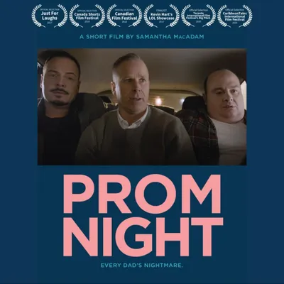
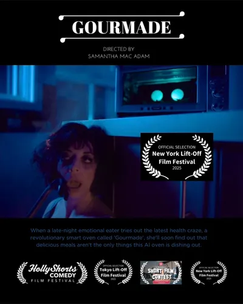
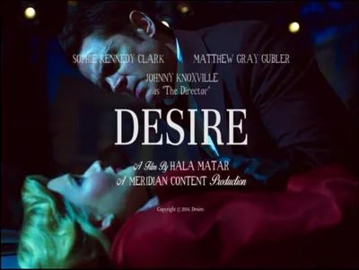
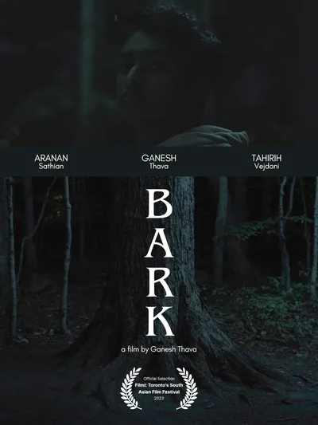
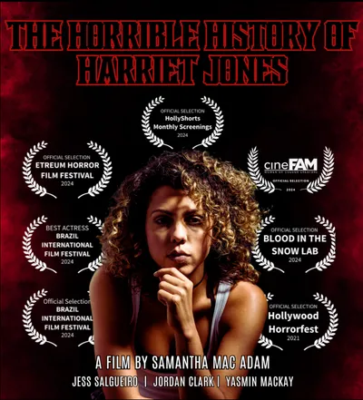

Portfolio & Digital Garden

<h1 class="hero-title">
  Moe's
  Frontmatters
</h1>

Game writer, designer, and marketer working at the intersection of storytelling and interactive media. Ten years spanning film & TV production, marketing, and UX design—now building narrative systems for games.

  <a href="/tags/writing" class="tag">Writing</a>
  <a href="/tags/producing" class="tag">Producing</a>
  <a href="/tags/marketing" class="tag">Marketing</a>
  <a href="/tags/video-games" class="tag">Video Games</a>
  <a href="/tags/film-tv" class="tag">Film & TV</a>

<a href="#games" class="nav-card">
  01
  <h2 class="nav-card-title">Games</h2>
  
Cinematics, character work, lore, and worldbuilding artifacts.

</a>

<a href="#film-tv" class="nav-card">
  02
  <h2 class="nav-card-title">Film & TV</h2>
  
Produced shorts, screenwriting samples, and credits.

</a>

<a href="#marketing" class="nav-card">
  03
  <h2 class="nav-card-title">Marketing</h2>
  
Content strategy frameworks and UX case studies.

</a>

<a href="/Digital-Garden/" class="nav-card">
  04
  <h2 class="nav-card-title">Digital Garden</h2>
  
Notes, reflections, and works-in-progress.

</a>

  Games

  <h2>Cinematics & Cutscenes</h2>
  2 artifacts

  

    <a href="#" class="artifact-title-link">
      Artifact <svg viewBox="0 0 12 12" fill="none" stroke="currentColor" stroke-width="1.5">
            <path d="M6 2v7M3 6l3 3 3-3M2 10h8"/>
          </svg>
    </a>
    <a href="/projects/ollie-oxenfree" class="artifact-title-link">
      Ollie Oxenfree <svg viewBox="0 0 12 12" fill="none" stroke="currentColor" stroke-width="1.5"><path d="M3 9L9 3M9 3H5M9 3v4"/></svg>
    </a>
    Cinematic | Fantasy, Action-Adventure, RPG | 3 pages
  

  <h3 class="artifact-title">"New Dog, Old Tricks"</h3>
  

    A young technician and her robotic dog chase a lead on her missing brother, uncovering something far stranger in an old woman's house. A cinematic quest moment that blends dark humor, visual spectacle, and a major turning point.
  

  

    <svg xmlns="http://www.w3.org/2000/svg" width="18" height="18" viewBox="0 0 24 24" fill="none" stroke="currentColor" stroke-width="2" stroke-linecap="round" stroke-linejoin="round" class="lucide lucide-trophy-icon lucide-trophy"><path d="M10 14.66v1.626a2 2 0 0 1-.976 1.696A5 5 0 0 0 7 21.978"/><path d="M14 14.66v1.626a2 2 0 0 0 .976 1.696A5 5 0 0 1 17 21.978"/><path d="M18 9h1.5a1 1 0 0 0 0-5H18"/><path d="M4 22h16"/><path d="M6 9a6 6 0 0 0 12 0V3a1 1 0 0 0-1-1H7a1 1 0 0 0-1 1z"/><path d="M6 9H4.5a1 1 0 0 1 0-5H6"/></svg> Runner-Up (top 10 of 50) in ELVTR's Game Writing Competition
  

  

    <a href="#" class="artifact-title-link">
      Artifact <svg viewBox="0 0 12 12" fill="none" stroke="currentColor" stroke-width="1.5">
            <path d="M6 2v7M3 6l3 3 3-3M2 10h8"/>
          </svg>
    </a>
    <a href="/projects/samsaras-edge" class="artifact-title-link">
      SamSara's Edge <svg viewBox="0 0 12 12" fill="none" stroke="currentColor" stroke-width="1.5"><path d="M3 9L9 3M9 3H5M9 3v4"/></svg>
    </a>
    Cinematic · Sci-Fi, Dark Comedy, Action-Adventure · 3 pages
  

  <h3 class="artifact-title">"A Visit to the Magistrate"</h3>
  

    A trial scene where a dysfunctional couple attempt to emotionally manipulate a sensitive, anthophile AI judge into choosing their partner as the first to enter a roguelite dungeon.
  

  <h2>Character Work</h2>
  3 artifacts

  

    <a href="#" class="artifact-title-link">
      Artifact <svg viewBox="0 0 12 12" fill="none" stroke="currentColor" stroke-width="1.5">
            <path d="M6 2v7M3 6l3 3 3-3M2 10h8"/>
          </svg>
    </a>
    <a href="/projects/ollie-oxenfree" class="artifact-title-link">
      Ollie Oxenfree <svg viewBox="0 0 12 12" fill="none" stroke="currentColor" stroke-width="1.5"><path d="M3 9L9 3M9 3H5M9 3v4"/></svg>
    </a>
    Barksheet · Sci-Fi, Fantasy · 1 spreadsheet
  

  <h3 class="artifact-title">Ollie Liviere</h3>
  

	Barks with VO direction, triggers, and firing conditions in combat, stealth, puzzle-solving, and AFK moments.
  

  

    <a href="#" class="artifact-title-link">
      Artifact <svg viewBox="0 0 12 12" fill="none" stroke="currentColor" stroke-width="1.5">
            <path d="M6 2v7M3 6l3 3 3-3M2 10h8"/>
          </svg>
    </a>
    <a href="/projects/ollie-oxenfree" class="artifact-title-link">
      Ollie Oxenfree <svg viewBox="0 0 12 12" fill="none" stroke="currentColor" stroke-width="1.5"><path d="M3 9L9 3M9 3H5M9 3v4"/></svg>
    </a>
    Biography · Sci-Fi, Fantasy · 1 spreadsheet
  

  <h3 class="artifact-title">Ollie Liviere</h3>
  

    Comprehensive character bio covering psychology, voice systems, relationship dynamics, moral framework, and formative backstory. 
  

  

    <a href="#" class="artifact-title-link">
      Artifact <svg viewBox="0 0 12 12" fill="none" stroke="currentColor" stroke-width="1.5">
            <path d="M6 2v7M3 6l3 3 3-3M2 10h8"/>
          </svg>
    </a>
    
    Howard the Duck x Spider-Ham 
    Barksheet · Action-Adventure · 1 spreadsheet
  

  <h3 class="artifact-title">Howard the Duck</h3>
  

    Barks with partner dynamics, escalation patterns, meta-commentary, and conditional firing logic in combat, stealth, exploration, and traversal.
  

  <h2>Lore & Worldbuilding</h2>
  2 artifacts

  

    <a href="#" class="artifact-title-link">
      Artifact <svg viewBox="0 0 12 12" fill="none" stroke="currentColor" stroke-width="1.5">
            <path d="M6 2v7M3 6l3 3 3-3M2 10h8"/>
          </svg>
    </a>
    <a href="/projects/grim-rock" class="artifact-title-link">
      Grim Rock <svg viewBox="0 0 12 12" fill="none" stroke="currentColor" stroke-width="1.5"><path d="M3 9L9 3M9 3H5M9 3v4"/></svg>
    </a>
    Bestiary · Dark Fantasy, Action-Adventure, RPG  · 1 page
  

  <h3 class="artifact-title">Gremlin</h3>
  

    The scourge of WWII British pilots reimagined as a "Class B" biological parasite in a 60s FBI profile. An environmental hazard with high-risk-high-reward social mechanics.
  

  

    <a href="#" class="artifact-title-link">
      Artifact <svg viewBox="0 0 12 12" fill="none" stroke="currentColor" stroke-width="1.5">
            <path d="M6 2v7M3 6l3 3 3-3M2 10h8"/>
          </svg>
    </a>
    <a href="/projects/grim-rock" class="artifact-title-link">
      Grim Rock <svg viewBox="0 0 12 12" fill="none" stroke="currentColor" stroke-width="1.5"><path d="M3 9L9 3M9 3H5M9 3v4"/></svg>
    </a>
    Collectible · Dark Fantasy, Action-Adventure, RPG · 1 page
  

  <h3 class="artifact-title">Joseph McCarthy's Letter</h3>
  

    Post-game collectible in which alt-60s CIA Director Joseph McCarthy criticizes a video game proposal and recommends a very McCarthyist course of action.
  

  Marketing

  

    Due to confidentiality agreements, case studies below emphasize methodology and strategic approach rather than final deliverables.
  

  

    <a href="/digital-garden/the-otter-side" class="artifact-title-link">
      The Otter Side <svg viewBox="0 0 12 12" fill="none" stroke="currentColor" stroke-width="1.5"><path d="M3 9L9 3M9 3H5M9 3v4"/></svg>
    </a>
    Content Strategy & Marketing  · Mobile Game · Cozy Runner 
  

  <h3 class="artifact-title">Building a Brand Voice for an Indie Mobile Game</h3>
  

    Comprehensive content strategy framework including thematic positioning, messaging architecture, voice systems, and multi-platform campaign roadmaps for indie studio's debut mobile title.
  

  

    <a href="/projects/fitin" class="artifact-title-link">
      FitIn.io <svg viewBox="0 0 12 12" fill="none" stroke="currentColor" stroke-width="1.5"><path d="M3 9L9 3M9 3H5M9 3v4"/></svg>
    </a>
    UX Design & Strategy · Social Enterprise · Wellness SaaS
  

  <h3 class="artifact-title">UX Design & User Research for a Wellness Booking App</h3>
  

    Ethical marketplace connecting fitness seekers with inclusive classes and trainers. Delivered wireframes, prototypes, and user research that attracted investor interest during pre-launch.
  

  Film & TV

A selection of work I've produced. In addition to other roles across the development/production value chain, I've worked as a consultant for production companies, grants bodies, financiers and equity investors in Canada, US, and the Arabian Gulf.

<a href="/projects/prom-night" class="film-card">
  
  

    <h3>Prom Night (2017)</h3>
    
<strong>Role:</strong> Producer, Production Manager

    
<strong>Genre:</strong> Comedy · 13m 28s

    
<strong>Dir:</strong> Sam MacAdam

    
<strong>Cast:</strong> Gerry Dee, Trevor Tordjman, Carol Huska

    
Three overprotective fathers find a positive pregnancy test and go on a mission to find out before the end of prom night which one of their teens is pregnant.

  

</a>

<a href="https://vimeo.com/1058828508" class="film-card">
  
  

    <h3>Gourmade (2024)</h3>
    
<strong>Role:</strong> Co-Producer

    
<strong>Genre:</strong> Mock Commercial, Comedy · 2m 45s

    
<strong>Dir:</strong> Sam MacAdam

    
<strong>Cast:</strong> Paloma Nuñez, Emma Hunter

    
A late-night emotional eater find out that delicious meals aren't the only things this  revolutionary smart oven called 'Gourmade' is dishing out.

  

</a>

<a href="https://www.youtube.com/watch?v=6ZXmlmHNco0" class="film-card">
  
  

    <h3>Desire (2014)</h3>
    
<strong>Role:</strong> Executive Producer

    
<strong>Genre:</strong> Drama · 13m 52s

      
<strong>Dir:</strong> Hala Matar

    
<strong>Cast:</strong> Johnny Knoxville, Sophie Kennedy Clarke, Matthew Gray Gubler, Lydia Hearst

    
A silver screen actress drifts in and out of her character as she longs for the love of her co-star.

  

</a>

<a href="/projects/bark" class="film-card">
  
  

<h3>Bark (2023)</h3>
    
<strong>Role:</strong> Producer, Production Manager

    
<strong>Genre:</strong> Drama  ·  13m 8s

    
<strong>Dir:</strong> Ganesh Thava

    
<strong>Cast:</strong> Aranan Sathian, Ganesh Thava

    
A queer South Asian boy on the verge of self-discovery wages a silent battle against the rigid expectations imposed upon him.

  

</a>

<a href="/projects/harriet" class="film-card">
  
  

    <h3>Harriet Jones (2023)</h3>
    
<strong>Role:</strong> Producer, PM

    
<strong>Genre:</strong> Horror · 7m 7s

    
<strong>Dir:</strong> Sam MacAdam

    
<strong>Cast:</strong> Jessica Salgueiro, Jordan Clark

    
An innocent game of Marco Polo between two cousins takes a sinister turn when one is killed. Decades later, Harriet, the sole survivor, is driven mad with guilt, plagued by waking nightmares — or is it her cousin back for one more game?

  

</a>

  Digital Garden

This part of the site documents my experience with completed projects and works-in-progress through case studies, post-mortems, reflections, and observations. It's also an ongoing process of learning in public, a way to show how I think and connect ideas across different domains.

